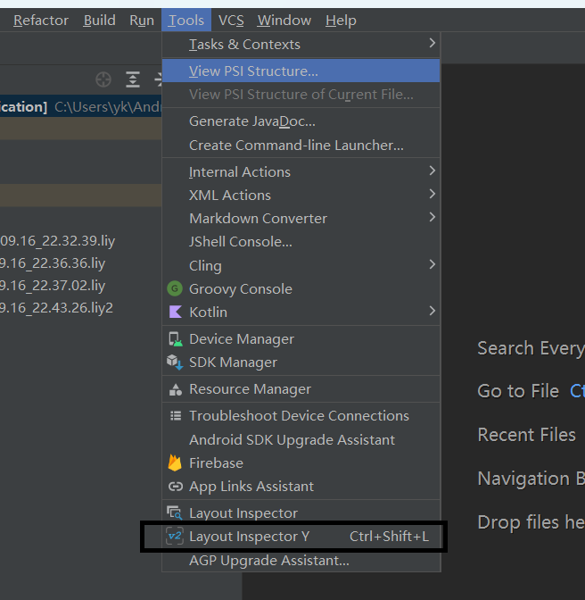
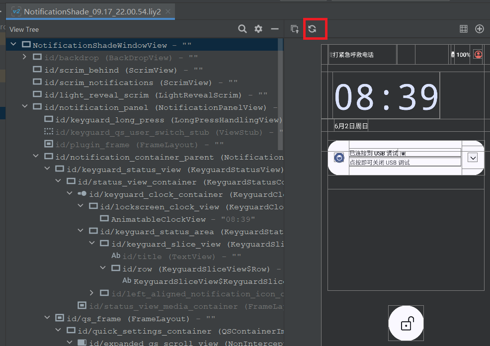
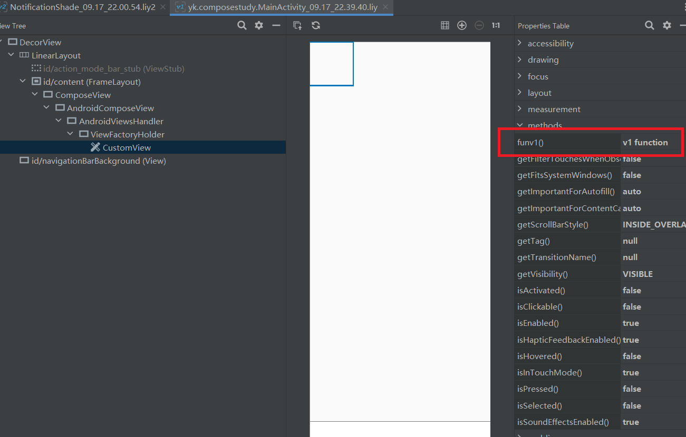

# Layout Inspector Y
## Abstract
This plugin is modified based on the old version of Layout Inspector and includes several convenient features. For system app developers, selecting specific windows to obtain layouts is crucial. However, the new version of AS Layout Inspector lacks this functionality, which is why this plugin is maintained and developed.

This project is developed based on https://github.com/pingfangx/androidstudiox and references the design of https://github.com/CoXier/LayoutInspectorV2-Pro. Tribute to pingfangx and CoXier.
## Install
Download the installation package -> Open AS -> Go to Settings -> Select Plugins -> Click the "Settings" gear icon -> Choose "Install Plugin From Disk"

## Instructions for Use
### Get Layout
click action or shortcut key

### Quickly Reacquire the Layout

### Custom print properties
The Layout Inspector supports a custom output property mechanism, as shown in the following figure.

#### [Detailed explanation](docs/custom_properties.md)
### 

## [Changelog](CHANGELOG.md)